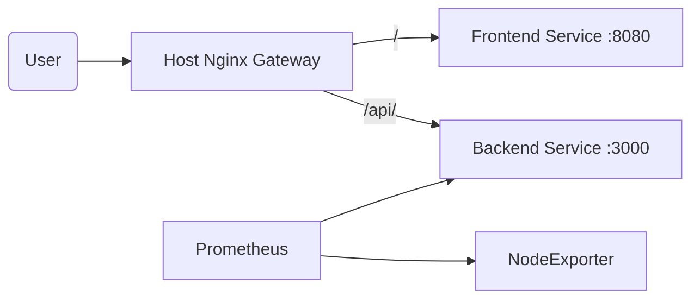

[](https://app.travis-ci.com/Septic-H/devops-portfolio-api)


# DevOps Portfolio: Microservices Architecture

A production-grade, distributed web application built with a **Microservices Architecture**. The application is decoupled into independent frontend and backend services, orchestrated via Docker, and deployed securely on a hardened Linux server.

**Live URL:** https://huzaifaj.tech/

## Live Monitoring Dashboard
*(Air-gapped Grafana dashboard accessing real-time server metrics via SSH Tunnel)*


## Architecture Overview

This project implements the **Reverse Proxy Pattern** to route traffic between isolated containers:


* Service A (Frontend): Lightweight Nginx container serving static assets (HTML/CSS/JS).

* Service B (Backend): Node.js/Express API handling business logic and health checks.

* Gateway: Host-level Nginx acting as a Layer 7 Reverse Proxy to terminate SSL and route traffic.

## Tech Stack
* **Runtime:** Node.js & Express
* **Orchestration:** Docker Compose (v2)
* **Proxy:** Nginx (SSL/TLS via Let's Encrypt)
* **CI/CD:** Travis CI (GitOps workflow)
* **Observability:** Prometheus (Metrics) & Grafana (Visualization)
* **Infrastructure:** DigitalOcean (Hardened Ubuntu VPS)

## Security & Architecture
* **Hardened Access:** Root login disabled. Password auth disabled (SSH Keys only).
* **Air-Gapped Monitoring:** Grafana dashboard is hidden from the public internet (localhost only) and accessed via SSH Tunneling.
* **Stability:** 1GB Swap configured to prevent OOM (Out of Memory) crashes.
* **Zero-Downtime:** Rolling updates via Docker Compose.

## The Pipeline
1.  **Push:** Commit code to `main`.
2.  **Build:** Travis CI builds independent images for s`ervices/frontend` and `services/backend`.
3.  **Test:** Unit tests run specifically against the Backend API logic.
4.  **Deploy:** Pipeline SSHs into the server, fetches changes, and rebuilds containers using `--remove-orphans` to clean up old microservices.

## Quick Start

### Run Locally (Full Stack)
```bash
# Clone and run everything (App + Prometheus + Grafana)
git clone https://github.com/Septic-H/devops-portfolio-api.git
docker compose up -d --build

# API: http://localhost:3000
# Grafana: http://localhost:3001 (Default: admin/admin)
```

### Directory Structure
```bash
├── services/
│   ├── frontend/   # Nginx Container (Static Site)
│   └── backend/    # Node.js Container (API)
├── docker-compose.yml
└── .travis.yml
```